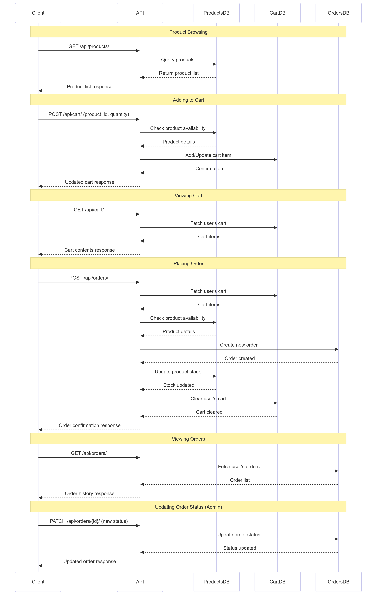

# Django E-commerce API

## Overview

This project is a robust RESTful API for an e-commerce platform built with Django and Django REST Framework. It provides endpoints for managing products, shopping carts, and orders, with a focus on data integrity, error handling, and scalability.

## Features

- Product catalog management
- Shopping cart functionality
- Order processing with stock management
- User authentication and authorization
- RESTful API design
- Comprehensive error handling and logging
- Built with Django and Django REST Framework

## System Architecture

The e-commerce API follows a typical e-commerce workflow, allowing users to browse products, manage their shopping cart, and place orders. The system's architecture and workflow are illustrated in the sequence diagram below:



### Key Workflow Steps:

1. **Product Browsing**: 
   - Users can retrieve a list of available products.
   - The API fetches product data from the database and returns it to the client.

2. **Cart Management**:
   - Users can add products to their cart, specifying the quantity.
   - The API checks product availability before adding to the cart.
   - Users can view and update their cart contents.

3. **Order Placement**:
   - Users can create an order based on their cart contents.
   - The API performs the following steps atomically:
     - Checks product availability
     - Creates a new order
     - Updates product stock
     - Clears the user's cart
   - An order confirmation is sent back to the client.

4. **Order Management**:
   - Users can view their order history.
   - Admins can update order statuses (e.g., from 'processing' to 'shipped').

5. **Error Handling**:
   - The system includes comprehensive error handling for scenarios such as:
     - Insufficient stock
     - Invalid input data
     - Authentication and authorization errors

## Technology Stack

- Python 3.8+
- Django 5.1.2
- Django REST Framework 3.14.0
- SQLite (can be easily switched to other databases for production)

## Installation

1. Clone the repository:
   ```
   git clone https://github.com/yourusername/django-ecommerce-api.git
   cd django-ecommerce-api
   ```

2. Create a virtual environment and activate it:
   ```
   python -m venv venv
   source venv/bin/activate  # On Windows, use `venv\Scripts\activate`
   ```

3. Install the required packages:
   ```
   pip install -r requirements.txt
   ```

4. Set up the database:
   ```
   python manage.py makemigrations
   python manage.py migrate
   ```

5. Create a superuser (for admin access):
   ```
   python manage.py createsuperuser
   ```

6. Run the development server:
   ```
   python manage.py runserver
   ```

The API will be available at `http://localhost:8000/api/`.

## API Endpoints

### API Root
- `GET /api/`: List all available endpoints

### Products
- List/Create: `GET`, `POST` `/api/products/`
- Retrieve/Update/Delete: `GET`, `PUT`, `PATCH`, `DELETE` `/api/products/{id}/`

### Cart
- List/Create: `GET`, `POST` `/api/cart/`
- Retrieve/Update/Delete: `GET`, `PUT`, `PATCH`, `DELETE` `/api/cart/{id}/`

### Orders
- List/Create: `GET`, `POST` `/api/orders/`
- Retrieve/Update/Delete: `GET`, `PUT`, `PATCH`, `DELETE` `/api/orders/{id}/`

## Authentication

This API uses token-based authentication. To authenticate:

1. Obtain a token:
   ```
   curl -X POST http://localhost:8000/api-token-auth/ -d "username=yourusername&password=yourpassword"
   ```

2. Include the token in the Authorization header for subsequent requests:
   ```
   curl -H "Authorization: Token YOUR_TOKEN_HERE" http://localhost:8000/api/products/
   ```

## Usage Examples

1. List all products:
   ```
   curl -H "Authorization: Token YOUR_TOKEN_HERE" http://localhost:8000/api/products/
   ```

2. Add an item to cart:
   ```
   curl -X POST http://localhost:8000/api/cart/ -H "Authorization: Token YOUR_TOKEN_HERE" -H "Content-Type: application/json" -d '{"product_id": 1, "quantity": 2}'
   ```

3. Place an order:
   ```
   curl -X POST http://localhost:8000/api/orders/ -H "Authorization: Token YOUR_TOKEN_HERE" -H "Content-Type: application/json" -d '{}'
   ```

## Error Handling

The API uses custom exception handling to provide clear and consistent error responses. Common HTTP status codes are used (e.g., 400 for bad requests, 404 for not found, 403 for forbidden actions).

## Logging

The project includes a logging configuration that logs errors and unexpected exceptions to a file (`debug.log`). This aids in debugging and monitoring the application.

## Testing

To run the test suite:

```
python manage.py test
```

## Deployment

For production deployment:

1. Set `DEBUG = False` in `settings.py`
2. Use environment variables for sensitive information (e.g., `SECRET_KEY`, `DATABASE_URL`)
3. Use a production-grade server like Gunicorn
4. Set up a reverse proxy with Nginx
5. Use a production database (e.g., PostgreSQL)
6. Implement proper security measures (HTTPS, secure cookies, etc.)

## Contributing

Contributions are welcome! Please feel free to submit a Pull Request.

## License

This project is licensed under the MIT License - see the [LICENSE.md](LICENSE.md) file for details.